# BAVIC roles and access

Roles in this app follow *Key Personnel Roles and Responsibilities on the BAVIC Daily Operations System*. Permissions are DocType-level. They install with `bench migrate` from the Role fixture, each DocType's permission table, report roles, and the Bavic Insurance workspace.

Named people are not created as users by the app. Assign the roles on the site after migrate.

## How a duty becomes a role

```mermaid
flowchart TB
  execSponsor[Executive Sponsor] --> rExec[BAVIC Executive]
  systemOwner[System Owner] --> rOwner[BAVIC System Owner]
  techAdmin[Technical System Administrator] --> rAdmin[BAVIC System Administrator]
  dataOwner[Department Data Owner] --> rData[BAVIC Department Data Owner]
  directorOps[Director of Operations] --> rDir[BAVIC Director of Operations]
  hrPartner[Performance Management Partner] --> rSuper[BAVIC Team Supervisor]
  salesEnd[Sales End User] --> rSales[BAVIC Sales User]
  financeUser[Financial User] --> rFin[BAVIC Finance User]
  clientUser[Client Support] --> rSupport[BAVIC Client Support]
  auditor[Compliance Reviewer] --> rAudit[BAVIC Compliance Reviewer]
  vendor[External User] --> rExt[BAVIC External User]

  rExec --> reports[Reporting and analytics]
  rOwner --> reports
  rOwner --> settings[Bavic Settings]
  rAdmin --> userAdmin[User administration]
  rAdmin --> settings
  rDir --> sales[Sales and premium]
  rDir --> commission[Commission]
  rDir --> clients[Client and policy records]
  rDir --> performance[Performance]
  rDir --> reports
  rData --> sales
  rData --> clients
  rData --> performance
  rData --> reports
  rSuper --> performance
  rSuper --> sales
  rSales --> sales
  rSales --> clients
  rFin --> commission
  rFin --> reports
  rSupport --> clients
  rAudit --> compliance[Compliance and audit]
  rAudit --> reports
  rExt --> clients
```

Section 2 describes the MD dashboard as read-only. Section 3 says the MD can open the system at any time. **BAVIC Executive** can read operational records, reports, and the performance dashboard, and cannot create or edit them.

## Who receives each role

A migrate patch creates these accounts at `firstname.lastname@bavicinsurance.co.tz` with password `Bavic@123`. Each account uses one Role Profile.

- consolatha.william@bavicinsurance.co.tz: BAVIC Executive
- alphonce.nyambita@bavicinsurance.co.tz: BAVIC System Owner and Administrator
- hatibu.zuberi@bavicinsurance.co.tz, tercy.tesimwa@bavicinsurance.co.tz, anna.michael@bavicinsurance.co.tz, doris.chacha@bavicinsurance.co.tz: BAVIC Department Data Owner
- devotha.william@bavicinsurance.co.tz: BAVIC Department Data Owner and Finance
- mwanahawa.msoke@bavicinsurance.co.tz: BAVIC Department Data Owner and Client Support
- aniceth.michael@bavicinsurance.co.tz: BAVIC Team Supervisor
- leonard.nyagiro@bavicinsurance.co.tz: BAVIC Compliance Reviewer

Employees, SFEs, and vendors are not created by the patch. Use Bulk User with the Sales User, External User, or other profile. Director of Operations is not named in the document.

System Manager stays with the technical owner of the Frappe site. It is not a business role.

## What each role can do

| Role | Access |
| --- | --- |
| BAVIC Executive | Read operations, settings, and reports |
| BAVIC System Owner | Read the app, write Bavic Settings, read User |
| BAVIC System Administrator | Full access on app DocTypes, create and disable User accounts, assign roles |
| BAVIC Director of Operations | Create and update operations, submit and cancel policies, run Excel import, read settings |
| BAVIC Department Data Owner | Create and update masters, customers, agents, claims, visits, and draft policies. No submit, delete, settings write, or Excel import |
| BAVIC Team Supervisor | Update agents, visits, and policies. Read customers and User. No account create |
| BAVIC Sales User | Enter customers, policies, visits, and recommendations. Read products, insurers, and agents |
| BAVIC Finance User | Update and submit policies, run Excel import, open financial reports |
| BAVIC Client Support | Update customers, claims, and visits. Read policies |
| BAVIC Compliance Reviewer | Read, print, and export app records and reports. No Excel import |
| BAVIC External User | Read client visits and business recommendations only |

`Target Detail` and `Policy Holder Detail` are child tables. They follow the parent DocType.

Number cards have no role list in Frappe. A card is visible when the user can read its DocType and open the performance dashboard. Workspace and dashboard chart roles are the eleven BAVIC roles plus System Manager.

A Sales user with read on Insurance Transaction can open every policy. The DocType has no user owner field, so this pass does not limit SFEs to their own records.
